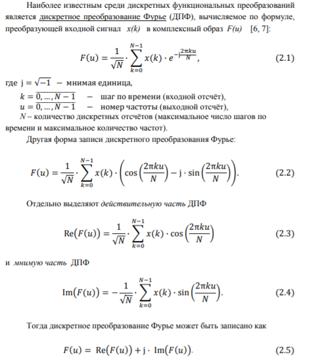
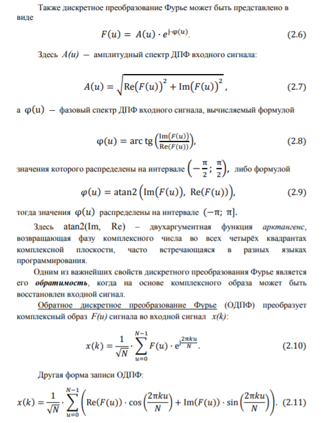

# Суть задания
Изучить прямое и обратное дискретное преобразование Фурье входных и выходных цифровых сигналов. Проверить возможное наличие у дискретных спектров таких явлений как: повтор спектра, осевая симметрия спектра, центральная симметрия спектра. Установить точность восстановления цифрового сигнала для прямого и обратного дискретных преобразований. Разработать программу на языке С++ для решения задачи дискретного преобразования. Запрограммировать и исследовать дискретное функциональное (тригонометрическое) преобразование. Вывести результаты в форматированной таблице и записать в файл.
# Теория

